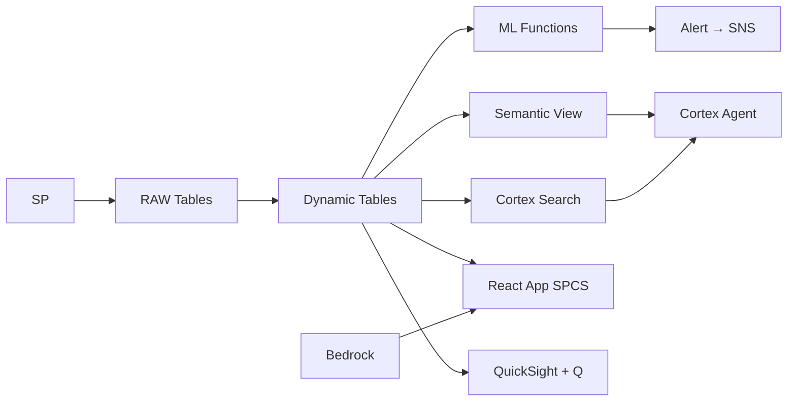

# Guest Experience 360

Unified guest profiles across 120 properties — Comprehend analyzes sentiment from reviews, Personalize drives recommendations via Cortex Complete, and SES delivers personalized communications through Notification Integration.

## Architecture

Thailand's premier hotel group manages 120 properties hosting 180,000 guests annually. Guest reviews across 4 languages reveal declining satisfaction — but fragmented data across OTA platforms means 342 unhappy guests are waiting for recovery while personalization opportunities worth ฿95M go untapped.



## Snowflake Capabilities

| Capability | Implementation |
|-----------|---------------|
| Dynamic Tables | GUEST_SENTIMENT_SCORES / GUEST_LIFETIME_VALUE / SERVICE_RECOVERY_QUEUE / PROPERTY_NPS_TRENDS |
| ML Functions | ML.FORECAST + ML.ANOMALY_DETECTION |
| Cortex AI | AI_SENTIMENT, COMPLETE, AI_EXTRACT |
| Cortex Search | 200000 documents indexed |
| Cortex Agent | GUEST_EXPERIENCE_AGENT |
| Semantic View | GUEST_ANALYTICS |
| React App (SPCS) | 5 tabs + DemoGuide |


## AWS Services

| Service | Role in Demo |
|---------|-------------|
| Amazon Comprehend | Sentiment analysis on 200K guest reviews in Thai/English/Chinese |
| Amazon Personalize | Generate personalized guest recommendations and offers |
| Amazon SES | Send personalized guest communications and offers |
| Amazon Bedrock (Claude) | Generate personalized outreach content in guest's language |
| Amazon SNS | Alert guest relations on VIP negative sentiment |
| Amazon QuickSight + Q | Guest experience dashboard with NL queries |


## Personas

| Persona | Role | Key Questions |
|---------|------|---------------|
| **Natthawut Thongprasert** | VP Guest Experience | "What's our overall guest sentiment trend?" "Which properties have declining satisfaction?" |
| **Ploy Suwannapha** | Guest Relations Manager | "What does guest G-28471 prefer based on past stays?" "Show me guests with negative reviews who haven't been contacted." |


## Data

| Table | Rows | Description |
|-------|------|-------------|
| GUEST_PROFILES | 180,000 | Unified guest profiles across all properties |
| STAY_HISTORY | 450,000 | Historical stay records with preferences and spend |
| GUEST_REVIEWS | 200,000 | Reviews from TripAdvisor, Google, Agoda, Booking.com |
| SERVICE_INTERACTIONS | 350,000 | Guest service requests, complaints, and resolutions |
| LOYALTY_PROGRAM | 85,000 | Loyalty tier data, points, and redemptions |
| PERSONALIZATION_ACTIONS | 25,000 | AI-generated personalized recommendations and offers |
| COMPETITOR_REVIEWS | 50,000 | Competitive set review data for benchmarking |
| THAI_TOURISM_TRENDS | 12 | Thailand tourism demographic and spending trends |


## Build Instructions

### Prerequisites
- Snowflake account with ACCOUNTADMIN access
- Cortex AI enabled (ML Functions, Search, Agent)
- Warehouse: GUEST_WH (Medium)
- AWS CLI with access (us-west-2)

### Deployment

```bash
snowsql -f snowflake/00_setup.sql
snowsql -f snowflake/01_marketplace_install.sql
snowsql -f snowflake/02_raw_tables.sql
snowsql -f snowflake/03_staging.sql
snowsql -f snowflake/04_dynamic_tables.sql
snowsql -f snowflake/05_search.sql
snowsql -f snowflake/06_ml_models.sql
snowsql -f snowflake/07_semantic_view.sql
snowsql -f snowflake/08_agent.sql
```

### React App (SPCS)
```bash
cd app && npm ci && npm run build
docker build -t aws-thailand-tourism-guest-360-app .
docker push bdiqc8sm-default.registry.snowflakecomputing.com/guest_experience/app/aws_thailand_tourism_guest_360/app:latest
```

### Demo Mode
Open the app URL with `?demo=true` for presenter view.

## Build Modes

### Snowflake Only
Run scripts 00-08 (skip AWS-specific integration). Uses:
- **AI_SENTIMENT (native)** instead of Amazon Comprehend
- **Cortex Complete (personalization)** instead of Amazon Personalize
- **Notification Integration (email)** instead of Amazon SES
- **Cortex Complete** instead of Amazon Bedrock (Claude)
- **Alerts + Notification Integration** instead of Amazon SNS
- **Snowflake Intelligence (Cortex Analyst)** instead of Amazon QuickSight + Q

### Full AWS + Snowflake
Run all scripts including AWS integration. Deploy QuickSight dashboard from `quicksight/`.

## Business Impact

Industry research and Snowflake customer outcomes:
- **Thailand's hotel industry generated ฿680B in revenue in 2023 from 28M international arrivals** — [TAT Thailand](https://www.tat.or.th/en)
- **Personalized guest experiences increase repeat booking rates by 20-40%** — [McKinsey Hospitality](https://www.mckinsey.com/industries/travel-logistics-and-infrastructure/our-insights)
- **Service recovery within 24 hours retains 70% of dissatisfied guests vs 30% without** — [Harvard Business Review](https://hbr.org/topic/customer-service)
- **AI-driven sentiment analysis improves guest satisfaction scores by 8-12 NPS points** — [Deloitte Hospitality](https://www2.deloitte.com/us/en/pages/consumer-business/topics/hospitality.html)


## Key Demo Numbers

- **0.72 sentiment** portfolio average (down from 0.78 — declining trend)
- **342 guests** in service recovery queue awaiting follow-up
- **200K reviews** analyzed by AI_SENTIMENT across 4 languages
- **25,000 offers** personalized recommendations generated for upcoming stays
- **7 properties** showing declining NPS trends
- **฿95M** personalization revenue opportunity (US$2.7M)


## License

Apache 2.0 — See [LICENSE](LICENSE) for details.

This is a personal demo project and is not an official Snowflake offering. It comes with no support or warranty.